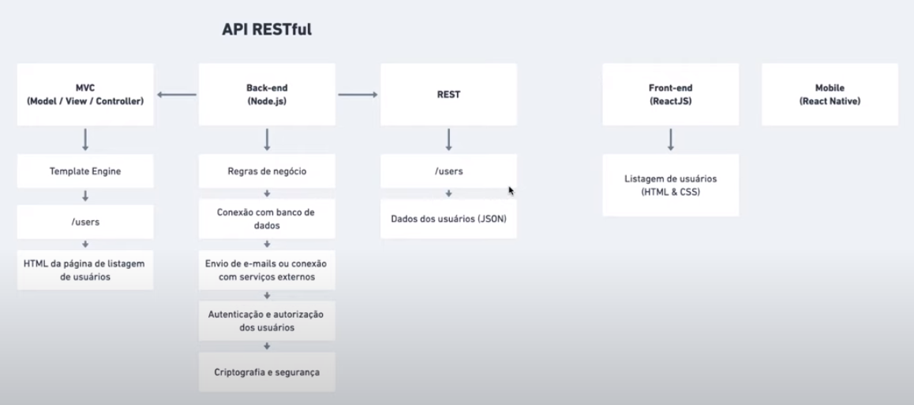

# Next Level Week #1 • Rocketseat • 01 jun 2020

## Api RESTful



## Por que o TypeScript

```js
/**
 * Funcção que exibe dados do usuário
 */
function displayUserInformation(user) {
  return `${user.name} – ${user.email}`;
}

export default displayUserInformation;
```

Diante do exemplo acima, nos deparamos com os seguintes desafios ao tentar adicionar ao retorno da função informações sobre o estado e a cidade do usuário:

- Qual o formato do objeto de usuário?
- Utilizo `user.city` ou `user.address.city`?
- Será que cidade e estato são informações obrigatórias?

### Mitos e verdades sobre o TypeScript

- TypeScript diminui a produtividade (isso pode acontecer para quem já está acostumado com a tipagem dimânica)
- TypeScript é transformar JavaScript em Java ou C# (MITO)
- O mercado não usa TypeScript (MITO)
- O TyperScript substitui o JavaScript por completo (MITO)
- TypeScript atrapalha quem é iniciante (bem parecido com o primeiro mito, isso pode acontecer com quem está acostumado com a tipagem dinâmica)
